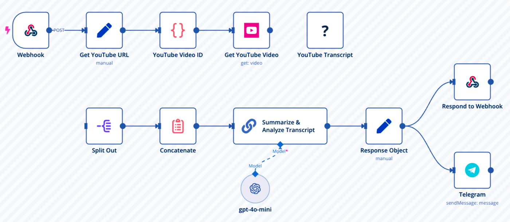

# 🎥 YouTube Transcript Summarizer Automation

This project automates the process of extracting a YouTube video transcript, summarizing it using **GPT-4o-mini**, and sending the summary directly to **Telegram** — all done through **Make.com (Integromat)**.

---

## 🧩 Workflow Overview

### Steps:
1. **Webhook Trigger:** Receives YouTube video URL.
2. **Extract Video ID:** Gets the video ID from the URL.
3. **Get Transcript:** Fetches video transcript using YouTube API.
4. **Split & Concatenate:** Combines the transcript text.
5. **Summarize & Analyze:** Uses GPT-4o-mini to summarize the transcript.
6. **Send to Telegram:** Sends summarized text to a Telegram chat.

---

## ⚙️ Tools Used
- 🧠 **OpenAI GPT-4o-mini**
- 🔗 **Make.com (Integromat)**
- 💬 **Telegram Bot**
- 📺 **YouTube Transcript API**
- 🌐 **Webhook Trigger**

---

## 🚀 How to Use
1. Open [Make.com](https://www.make.com).
2. Import the `workflow.json` file.
3. Connect:
   - Your Telegram Bot
   - OpenAI GPT account
   - YouTube Transcript module
4. Add your Telegram Chat ID and API keys.
5. Run the scenario & send any YouTube URL to the webhook.

---

## 📁 Files Included
| File | Description |
|------|--------------|
| `workflow.json` | Exported Make.com automation blueprint |
| `workflow.png` | Visual diagram of the workflow |
| `README.md` | Project documentation |

---
---

## 💬 Author
**Withpiyushhz Ai Automation**  
🚀 Automating the Future with AI  

🔗 **Connect with me on LinkedIn:** [linkedin.com/in/piyush2707](https://www.linkedin.com/in/piyush2707)
